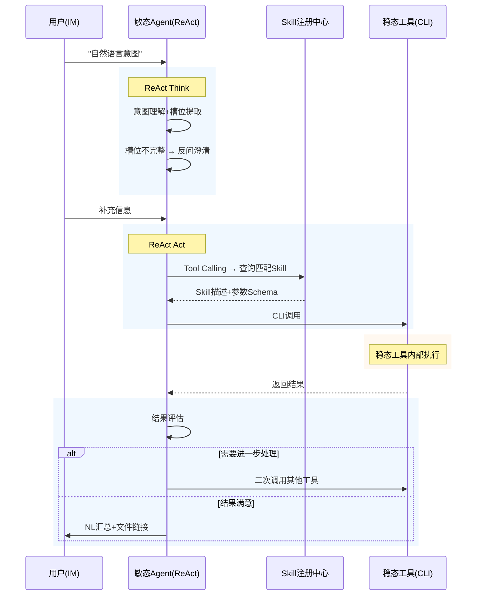
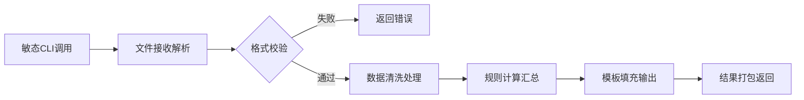
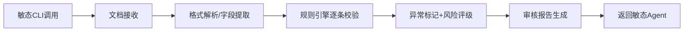
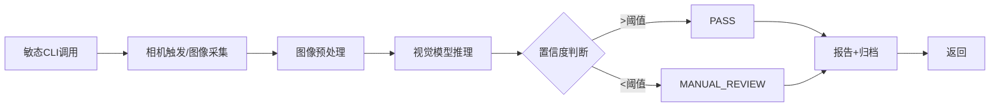

# 步骤2输出模板

## 文档结构

```
# 项目名 · 建模与结构化

## 目录
1. 全栈架构总览
2. L1 应用交互层
3. L2 智能体层 — 数字员工引擎
4. L2 智能体层 — Skill 开放体系
5. L2 智能体层 — 稳态工具
6. 敏态调度BPMN
7. 敏态数字员工 · 用户故事
8. 稳态工具 · Skill契约（YAML）
9. 稳态工具 · 内部BPMN
10. 稳态工具 · 用户故事
11. 领域对象模型
12. L3 平台底座层
13. V1/V2 功能边界清单
14. Skill注册清单（汇总）
```

## 架构图模板

使用 ASCII art 绘制三层架构图，格式：

```
L1 应用交互层 — 人类员工入口
├── 统一智能体工作台(WEB SPA): 货架式、SSO、搜索筛选
├── 移动生态入口(IM): ChatOps、任务中心、结果查看
└── 工具智能体独立前端: 直连模式、表单参数

L2 智能体层
├── 数字员工智能体(敏态ReAct)
│   ├── 6个内部引擎: 意图理解/流程规划/Skill加载/工具调度/结果校验/复盘优化
│   └── Harness工程: 提示词模板库、少样本示例、约束规则
├── Skill 开放体系(中枢枢纽)
│   ├── 注册中心: Skill注册、Schema管理
│   ├── 发现中心: 语义搜索、标签过滤
│   ├── 权限鉴权: RBAC、Token、配额
│   ├── 版本管理: SemVer、切换、回滚
│   ├── 监控计量: 调用次数、成功率、延迟
│   └── 调度网关: 统一入口、路由、异步队列
└── 工具智能体(稳态LangChain)
    └── CLI封装 → Skill注册 → 四大模块架构(数据接入/前端/管理后台/编排)

L3 平台底座层 — 同时支撑L2两层
├── 大模型推理服务
├── RAG知识库与文档处理
├── 统一组织权限与数据脱敏
├── 外部系统集成网关(V2预留)
├── 日志、审计、监控、告警
└── 数据存储与计算引擎
```

## 敏态调度BPMN (Mermaid sequence)



## 稳态工具内部BPMN (Mermaid flowchart)

四种流程模式模板：

### 模式A: 报告生成流



### 模式B: 文档审核流



### 模式C: 视觉检测流



### 模式D: 生成式流


## Skill契约 YAML Schema

```yaml
skill:
  name: "中文名称"
  id: "kebab-case-id"
  owner_agent: "归属的敏态Agent名称"
  description: >
    工具功能描述，含触发词，供敏态Agent做Function Calling时语义匹配。
  trigger_mode: ["prompt" | "scheduled" | "signal"]
  parameters:
    param_name:
      type: "string" | "number" | "file" | "enum" | "array"
      required: true | false
      accept: [".xlsx", ".csv"]  # file类型时
      options: ["选项1", "选项2"]  # enum类型时
      description: "参数说明"
  returns:
    result_name:
      type: "file" | "text" | "json" | "array" | "number"
      formats: [".pdf"]  # file类型时
      description: "返回说明"
  v1_data_source: "文件上传" | "工业相机采集" | "对话输入"
  v1_prerequisite: "前置条件说明（可选）"
  v2_reserved:
    - "V2预留功能"
```

## 用户故事格式

```
| ID | 用户故事 | 验收条件 |
|----|---------|---------|
| XX-01 | 作为<角色>，我期望<功能>，以便<价值> | 可量化的验收条件 |
```

## 领域对象模型格式

```
层次/限界上下文名称
├── 实体 (EntityName)
│   ├── 属性: type
│   └── 状态枚举
```

## V1/V2 边界清单格式

```
> ★ = V1必须实现 | ☆ = V2预留 | ◆ = V1前置条件

### 按功能模块汇总
| 功能模块 | V1范围 | V2预留 |
|---------|--------|--------|

### 按智能体汇总
| 智能体 | V1就绪度 | 风险点 |
|--------|---------|--------|
```
